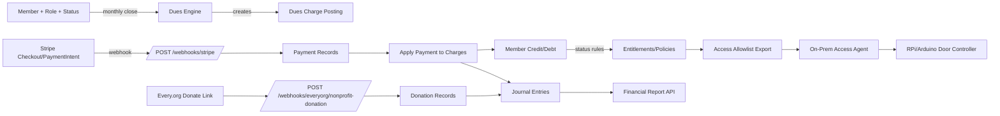

# Bloominglabs Membership, Access, and Finance System Spec for Codex

Reference research document. This file captures background analysis and source-linked synthesis; use [`spec.md`](./spec.md) and the ADRs for current implementation authority.

## Executive summary

Bloominglabs has two membership classes—full-dues members (voting) and hardship members (reduced dues, non-voting)—and dues are monthly. citeturn7search6turn7search3 You also need to support **prepayment credits** (pay-ahead balances) and **debts** (arrears), and you want a continuously generated **Financial Report** over an arbitrary period covering dues, donations (tagged/designated), other income, and categorized expenses (ideally imported from the bank). Your existing historical documentation explicitly calls out “pay ahead” credit handling as a pain point in prior systems, so this is a first-class requirement, not an edge case. citeturn7search2

This spec recommends a **self-hosted Django + Postgres “modular monolith”** packaged with Docker Compose for portability, with clear internal module boundaries and event-driven integrations. Stripe remains the dues processor; Every.org remains the donations processor (ingested via webhook and/or CSV export). Stripe is used **without** Stripe Billing to avoid Stripe Billing’s additional “Billing volume” fee (0.7% pay-as-you-go) unless you intentionally opt into Billing later. citeturn1search3turn9view1

Key constraints that drive the design:

- Dues are due by the 15th each month and access can be disabled if an account gets over 3 months behind. citeturn7search0turn7search3  
- Slack is community/top-of-funnel; invites are manual; lapsed members may remain—so Slack is not an entitlement boundary.  
- RFID currently relies on a separate Django app + database + RPi/Arduino embedded system and is manually synced; the replacement must be modular and offline-tolerant. Bloominglabs has previously emphasized standalone/offline access logging as a goal. citeturn15search0turn15search1  
- Donations through Every.org can include a “designation” (a recommended program/project label, not a legal restriction) and Every.org provides a nonprofit donation webhook payload including `designation`. citeturn5view0turn5view1  
- Webhooks must be resilient: Stripe retries for up to ~3 days and does **not** guarantee event ordering; your handler must be idempotent and order-independent. citeturn6search1turn6search5

## Architecture and packaging

### Deployment model

Ship as a **single repo** with a **Docker Compose** stack:

- `app` (Django + DRF + server-rendered staff UI + member portal endpoints)
- `db` (Postgres)
- `redis` (Celery broker; optional but strongly recommended for scheduled tasks/outbox delivery)
- `worker` (Celery worker)
- `scheduler` (Celery beat)
- `access-agent` (optional on-prem container for door allowlist caching + controller bridge; deploy on the space RPi)

This fulfills “self-contained” and “may need to change hosts” by making the full system relocatable with persistent volumes + env vars.

### Internal modular boundaries

Implement as a modular monolith with strict Python package boundaries:

- `members/` (membership, roles, governance lifecycle, dues policy)
- `billing/` (Stripe integration and dues payments)
- `donations/` (Every.org ingestion and donor metadata)
- `ledger/` (double-entry-lite journal and reporting queries)
- `expenses/` (bank import + categorization)
- `access/` (RFID credentials, door allowlist, on-prem sync protocol)
- `integrations/` (email notifications, Slack notifications webhooks—optional)
- `audit/` (append-only logs; event/outbox)

### High-level event flow



Stripe webhook reliability and constraints that shape your handler: Stripe uses HTTPS webhooks and will retry automatically (with exponential backoff) for up to about three days in live mode; Stripe also explicitly states event delivery order is not guaranteed. citeturn6search1

## Domain model for membership, credit, and entitlements

### Membership roles and voting rights

Model membership “role” as a **membership class** aligned to the bylaws:

- `FULL` = full monthly dues, **voting rights**
- `HARDSHIP` = reduced monthly dues (half rate), **no voting rights** citeturn7search6

### Core member state

Key membership policy anchors from Bloominglabs docs:

- Dues due by the 15th of each month. citeturn7search0turn7search3  
- Access disabled if account gets over 3 months behind. citeturn7search0turn7search2  
- When processing new members: do not complete membership until first payment is received (historical “hard rule”). citeturn7search3  

Define a state machine:

- `APPLICANT` (optional if you implement sponsorship/objection workflow)
- `ACTIVE`
- `PAST_DUE` (soft state derived from arrears; does not necessarily suspend)
- `SUSPENDED` (entitlements removed; e.g., >3 months behind)
- `LEFT` (explicitly ended)

Slack membership is not tied to this state (your policy), but RFID and members-only mailing list should be.

### Prepayment credit and debt

Requirement: members can prepay arbitrary amounts; you must track and apply credit correctly (this was a known limitation in prior approaches). citeturn7search2

Design principle: separate:

- **Charges (what the member owes for a period)** from  
- **Payments (what money you received)** from  
- **Allocations (how payments satisfy charges)**.

This makes credit/debt deterministic and auditable.

Recommended model:

- `DuesSchedule` (per member): determines monthly dues amount (full or hardship; hardship is half of full), and due day (15 by default). citeturn7search0turn7search6  
- `DuesCharge` (one per member per month): amount, due date, “service month”.
- `Payment` (Stripe, cash/check/manual): amount, received date.
- `Allocation` (many-to-many): links a `Payment` to one or more `DuesCharge` records (FIFO oldest due first).
- `MemberBalanceView` (computed): `credit = payments - charges` (positive) or `debt = charges - payments` (positive).

Enforcement rule in code (policy module):

- If `debt_months >= 3` at or after the 15th, mark `SUSPENDED` and remove physical access entitlements. citeturn7search0turn7search3turn7search2

### Data types and invariants (Codex must enforce)

- All money stored as **integer cents** (avoid float).
- All posting/ledger operations must be transactionally safe in Postgres.
- Invariants tested with property tests:
  - Allocations never exceed payment amount.
  - Sum(allocations for a charge) ≤ charge amount.
  - Member credit/debt computed identically regardless of allocation order given deterministic FIFO rules.

## External integrations spec

### Stripe for dues

#### Key Stripe capabilities used

You need: card + wallets + ACH, programmatic charging, saved payment method for autopay, and strong webhook support.

- Stripe standard card pricing (US) is shown as **2.9% + 30¢** per successful domestic card transaction on Stripe’s US pricing page. citeturn1search3  
- Stripe ACH Direct Debit pricing is shown as **0.8% with a $5.00 cap** (and is supported as a recurring payment method). citeturn1search4turn13search0  
- ACH Direct Debit is delayed-confirmation; Stripe notes it can take up to ~4 business days to receive acknowledgement of success or failure; payout timing is listed as 2–5 days; settlement tables indicate standard T+4 or faster T+2 for eligible users. citeturn13search0  
- Stripe Checkout can dynamically present enabled payment methods; Stripe explicitly notes you can enable Apple Pay and Google Pay in Dashboard settings, and hosted Checkout pages do not require integration changes to enable them. citeturn14search0turn14search1  
- Off-session charging should be implemented by saving a payment method using **SetupIntents** (for future payments), then charging later with a **PaymentIntent** marked `off_session=true` (Stripe docs describe this flow). citeturn0search0turn0search3  

#### Important cost decision: avoid Stripe Billing unless needed

Stripe Billing pay-as-you-go is listed as **0.7% of Billing volume** (excluding one-off invoices). citeturn9view1  
Given Bloominglabs’ “essential simplicity” and “eliminate line items” goals, this spec defaults to **not using Stripe Billing**, and instead implements:

- Stripe Checkout (or Payment Element) for one-time payments / top-ups
- SetupIntent to save a payment method for autopay
- A monthly job to create a PaymentIntent for dues when a member’s internal credit is insufficient

This keeps Stripe costs to payment processing only, while keeping your credit/debt logic internal and correct.

#### Stripe objects used

- `Customer` (one per member; store `stripe_customer_id`)
- `Checkout Session` for:
  - “Add credit / prepay” payments
  - optional “Pay outstanding balance” payments
- `SetupIntent` for:
  - saving payment method for monthly off-session dues
- `PaymentIntent` for:
  - off-session monthly dues charges (amount can be conditional on internal credit)
- Webhooks:
  - `checkout.session.completed`
  - `payment_intent.succeeded`
  - `payment_intent.payment_failed`
  - `charge.dispute.created` / `charge.dispute.closed` (disputes exist and debits + fees occur) citeturn1search0turn1search2  

#### Webhook handling requirements (Stripe)

Stripe webhook endpoint must:

- Verify signature using `Stripe-Signature` header + `constructEvent()` with raw request body and the endpoint secret (`whsec_...`). citeturn6search0  
- Be idempotent and order-independent; Stripe explicitly does not guarantee event ordering. citeturn6search1  
- Record event IDs as processed; Stripe recommends skipping already processed events and returning success to stop retries; Stripe provides guidance for marking events “processing/processed.” citeturn6search5turn6search1  
- Expect retries: Stripe retries deliveries automatically (up to about three days live). citeturn6search1  

Also, when making Stripe API POST calls (e.g., create PaymentIntent), use `Idempotency-Key` header; Stripe documents that POST idempotency keys make it safe to retry within ~24 hours and that sending the same key with different parameters yields an error. citeturn6search2

#### Stripe settlement / payout expectations

Stripe notes that your initial payout is often scheduled 7–14 days after first successful payment and subsequent payouts follow your payout schedule. citeturn0search1turn0search4  
Separately, ACH Direct Debit has its own settlement timing windows (T+4 standard; T+2 faster for eligible accounts). citeturn13search0

Your system should therefore treat a successful Stripe payment as “received” for membership/entitlement purposes, but maintain a **Stripe clearing account** in the ledger for reconciliation to bank deposits.

#### Fee math examples

Stripe’s pricing pages provide the baseline rates used below: cards at 2.9% + $0.30 (US domestic) and ACH direct debit at 0.8% capped at $5. citeturn1search3turn1search4

| Example payment | Card fee (2.9% + $0.30) | Net via card | ACH fee (0.8%, cap $5) | Net via ACH |
|---:|---:|---:|---:|---:|
| $10 monthly dues | $0.59 | $9.41 | $0.08 | $9.92 |
| $25 monthly dues | $1.03 | $23.97 | $0.20 | $24.80 |
| $100 one-time credit | $3.20 | $96.80 | $0.80 | $99.20 |

(These are simplified; actual Stripe “net” can vary with payment method mix, disputes, refunds, international cards, etc. The system must compute real fees from Stripe balance transactions when possible.)

### Every.org for donations

You want donations tracked separately from dues, including donation “tags” such as specific tools/rooms/projects.

Every.org capabilities relevant here:

- Every.org nonprofit donation webhook sends JSON on completed donations including `chargeId` (unique), `amount`, `netAmount`, `currency`, `frequency`, `donationDate`, `paymentMethod`, and `designation` (intended program/project). citeturn5view0  
- Donate Link supports a `designation` parameter and explicitly notes it’s a recommendation not a legal restriction; it also supports `partner_donation_id` and `partner_metadata` (base64 JSON forwarded in partner webhook), and a `require_share_info` parameter to require donor contact sharing. citeturn5view1  
- Donors can opt out of sharing; donor identity may be absent/anonymous. citeturn2search2turn2search1  
- Accounting nuance: Every.org states donations are made to Every.org first; nonprofits receive disbursements/grants. For CRM entry, hard credit to Every.org and soft credit to the donor; and nonprofits should not issue tax receipts for Every.org grants. citeturn2search0turn2search9  

Implementation decision:

- Record each webhook donation as a `Donation` entity with optional donor identity, plus a `DonationDesignation` string and optional structured `partner_metadata` decoded if you choose to use Partner Webhooks. citeturn5view0turn5view1  
- In the ledger, treat it as **income** (donations) with metadata fields for designation/project attribution, while acknowledging disbursement may come later as a lump sum. citeturn2search9turn2search0  

### Bank expense import and categorization

Short-term goal: replace FreshBooks ledger and produce categorized financial reports. For expenses, prioritize **import** over manual entry.

Spec requirements:

- Support import of bank transactions via:
  - CSV upload (baseline)
  - Optional OFX/QFX/QIF import (nice-to-have; many tools support these)  
  (GnuCash’s documentation illustrates that a mature accounting tool commonly supports QIF/OFX/CSV imports; this is a reasonable target for your importer formats.) citeturn12search3turn11search2  

- Provide rule-based categorization:
  - match by merchant/description regex
  - match by amount ranges (utilities often stable)
  - manual overrides with audit logs

- Create a reconciliation surface:
  - “unreviewed transactions”
  - “categorized but unreconciled”
  - “reconciled”

### RFID/access control replacement

Your wiki history describes an RFID ecosystem with a Django web interface + SQLite backend and ideas to publish RFID events to MQTT; and earlier access control efforts emphasized standalone logging capability. citeturn15search0turn15search1

This spec recommends splitting access into two modules:

- **Access Core (in Django):** credential management + allowlist generation + audit logging.
- **On-Prem Access Agent (RPi):** caches allowlist, interfaces with Arduino/door hardware, optionally publishes events to local MQTT.

Key design constraint: the door must remain functional if the cloud host is down. Bloominglabs has valued standalone operation historically. citeturn15search1turn15search0

Minimal interface:

- Django endpoint: `GET /api/access/allowlist?v=<etag>` returns signed allowlist snapshot.
- Agent pulls snapshot on schedule (e.g., every 5 minutes), stores locally, and exposes a local interface to the Arduino (serial/USB or local TCP, whichever matches your current embedded setup).
- Membership status changes that affect entitlements produce an internal event consumed by an “AccessSync” job that updates allowlist version.

Slack: no membership enforcement. Optional: post administrative notifications (e.g., “member suspended due to arrears”) to a staff channel via an incoming webhook (not required).

## Bookkeeping, ledger design, and reporting

### Replace FreshBooks ledger functionally, not philosophically

FreshBooks can export Clients, Expenses, Invoices, and Reports as CSV/PDF for archival and migration. citeturn10search0turn10search1  
Your immediate requirement is not recreating FreshBooks UI; it’s eliminating FreshBooks cost while preserving accurate tracking + reporting.

### Minimal “double-entry-lite” journal

You need categories and a financial report; double-entry gives you auditability and consistency. The spec uses a journal model that can later export to Beancount or GnuCash.

Recommended tables:

- `Account`  
  - `code` (e.g., `ASSET:BANK`, `ASSET:STRIPE_CLEARING`, `INCOME:DUES`, `INCOME:DONATIONS`, `EXPENSE:RENT`, …)
  - `type` (ASSET/LIABILITY/INCOME/EXPENSE/EQUITY)
- `JournalEntry`  
  - `date`, `description`, `source` (stripe/every/bank/manual), `external_id`, `posted_by`
- `JournalLine`  
  - `entry_id`, `account_id`, `amount_cents` (signed), `memo`, optional dimensions:
    - `member_id` (for dues)
    - `designation` / `project_tag` (for donations)
    - `vendor` (for expenses)

Enforce: each `JournalEntry` must balance to 0 (sum of lines == 0).

### Accounting interpretations for Bloominglabs use-cases

Implement two parallel lenses (both generated from the same ledger + subledgers):

- **Cashflow lens:** money in/out by category over period (what most boards want monthly).
- **Membership lens:** member credit/debt aging, arrears months, and enforcement eligibility. (This is operational and also financially informative.)

A note on Every.org: because Every.org aggregates donations and disburses grants, your bank deposit might be a lump-sum grant; the ledger should support recording donor-level donations (soft credit) separately from the bank deposit (hard credit Every.org). citeturn2search0turn2search9

### Financial Report API

Endpoint:

- `GET /api/reports/financial?from=YYYY-MM-DD&to=YYYY-MM-DD&basis=cash|earned`

Response includes:

- Income summary:
  - dues received (cash basis)
  - dues earned (earned basis; monthly charges applied)
  - donations received (Every.org donation events; plus manual)
  - other income categories
- Expense summary by category
- Net surplus/deficit
- Reconciliation section:
  - bank balance changes
  - stripe clearing balance
  - outstanding receivables (member debt)
  - deferred dues (member credits)

### Export formats

Provide exports for:

- `GET /api/exports/journal.csv`
- `GET /api/exports/members.csv`
- `GET /api/exports/dues_charges.csv`
- `GET /api/exports/payments.csv`
- `GET /api/exports/donations.csv`
- `GET /api/exports/bank_transactions.csv`

This aligns with your desire for portability and the prior “plain text exportable” principle in your existing plan document (even though that doc targets Sheets). fileciteturn0file0L10-L27

## Codex implementation spec with TDD requirements

This section is written as a “Codex handoff”: precise tasks, endpoints, and required tests.

### Repository structure

- `backend/`
  - `config/` (Django settings)
  - `apps/`
    - `members/`
    - `billing/`
    - `donations/`
    - `ledger/`
    - `expenses/`
    - `access/`
    - `audit/`
  - `api/` (DRF routers / schema)
- `infra/`
  - `docker-compose.yml`
  - `Dockerfile`
  - `nginx/` (optional)
- `onprem/`
  - `access_agent/` (Python service; small; possibly FastAPI + sqlite)
- `tests/`
  - `unit/`
  - `integration/`
  - `contract/` (webhook payload fixtures)
- `docs/` (architecture + runbooks)

### Required endpoints (minimal)

Membership

- `POST /api/members/`
- `GET /api/members/`
- `PATCH /api/members/{id}/`
- `GET /api/members/{id}/balance/` → shows credit/debt, arrears months, next due date
- `POST /api/members/{id}/manual-payment/` → cash/check entry (also posts to ledger)

Stripe billing primitives

- `POST /api/billing/stripe/create-checkout-session/`
  - modes:
    - `top_up` (prepay credit)
    - `pay_balance` (pay outstanding)
- `POST /api/billing/stripe/create-setup-intent/` (autopay enrollment via SetupIntent) citeturn0search0

Webhooks

- `POST /webhooks/stripe/`
  - must verify signature (`Stripe-Signature`) and use raw body. citeturn6search0
- `POST /webhooks/everyorg/nonprofit-donation/`
  - must be idempotent via `chargeId`. citeturn5view0

Access

- `GET /api/access/allowlist/` (signed snapshot)
- `POST /api/access/events/` (optional; from agent/door)

Reports / exports

- `GET /api/reports/financial`
- `GET /api/exports/*.csv`

### Scheduled jobs

- `monthly_dues_close()` runs on the 1st (or configurable):
  - create `DuesCharge` for each active member (full/hardship amount)
  - apply existing credits via allocation (no Stripe charge yet)
- `dues_autopay_run()` runs daily (or on the 15th and periodically after):
  - for members with autopay enabled and insufficient credit, create off-session PaymentIntent for the amount needed to restore a 1-month buffer
  - use Stripe idempotency keys on POST requests citeturn6search2
- `enforcement_run()` runs daily:
  - compute arrears months and set `SUSPENDED` if >3 months behind (policy) citeturn7search0
  - emit event for access allowlist updates
- `stripe_reconciliation_sync()` nightly:
  - fetch Stripe payout/fee details needed for accurate ledger postings and bank reconciliation (implementation uses Stripe API; exact endpoints depend on your Stripe setup)
- `bank_import_reconcile()` (manual trigger + optional scheduled if you later add aggregator)

### Test-driven development rules

Codex must implement features using strict red-green-refactor:

For each logical unit:
1) design the test  
2) write the test  
3) confirm existing code fails  
4) implement  
5) confirm new code passes and all prior tests still pass  

This mirrors the discipline in your earlier plan, but now applied to Django/Stripe/every. fileciteturn0file0L520-L579

#### Required test categories

Unit tests (fast; no network)

- Dues amount calculation:
  - hardship = half of full
  - full = full
- Charge generation:
  - one `DuesCharge` per active member per month
  - due date on the 15th (configurable default) citeturn7search0
- Allocation FIFO correctness:
  - credit applies oldest charges first
  - partial allocation works
- Enforcement:
  - if arrears months >= 3 ⇒ suspended
  - if paid back below threshold ⇒ re-activate (policy decision; include test once decided)

Integration tests (db + mocked external APIs)

- Stripe webhook idempotency:
  - same `event.id` arrives twice → second is ignored and returns 2xx citeturn6search5
- Stripe signature verification:
  - invalid signature → 400
  - valid signature → processes event citeturn6search0
- Every.org webhook processing:
  - required fields parsed
  - `designation` stored if present citeturn5view0
  - anonymous donors allowed (no email) citeturn2search2

Contract tests (fixtures)

- Store canonical JSON fixtures for:
  - Stripe `payment_intent.succeeded`
  - Stripe `checkout.session.completed`
  - Every.org nonprofit webhook example payload (based on docs) citeturn5view0

End-to-end tests (optional but recommended)

- Spin docker-compose stack and run:
  - create member → create top-up session → simulate webhook → verify balance updates and ledger posts.

CI requirements

- Run tests on every commit
- Enforce minimum coverage for core financial logic (ledger, allocations, dues engine)
- Include database migration checks and linting

### Webhook security, retries, and idempotency patterns

Stripe pattern (mandatory)

- Store `stripe_event_id` with a unique constraint.
- Pseudocode:

```text
POST /webhooks/stripe:
  verify signature using Stripe-Signature + raw body + endpoint secret
  if event_id already processed: return 200
  mark event_id as processing (transaction)
  process by event.type:
    - payment_intent.succeeded: create Payment; allocate; post journal entry
    - payment_intent.payment_failed: mark attempt; notify if needed
    - charge.dispute.created: post reversal/fee entry
  mark event_id processed
  return 200
```

This aligns with Stripe’s guidance to skip already-processed events and still return success so retries stop. citeturn6search5turn6search1

Every.org pattern (mandatory)

- Use `chargeId` as the idempotency key. citeturn5view0  
- If Every.org later adds signing guidance, integrate it; until then, protect endpoint with:
  - unguessable URL path token
  - IP allowlisting if possible
  - strict JSON schema validation

## Open questions that affect implementation details

These are the minimum clarifications needed; the spec above assumes defaults where possible.

- What is the **current full monthly dues amount** (and therefore hardship = half)? (The bylaws define classes but not dollar values.) citeturn7search6  
- Do you want “earned dues” accounting (recognize income monthly when charge is applied) or purely cash basis for the Financial Report, or both?  
- What is the authoritative “month boundary” behavior: are invoices/charges always generated on the 1st and due on the 15th (historical expectation)? citeturn7search3turn7search0  
- For access: do you need multiple doors/controllers now, and what exact interface does the Arduino expect from the RPi today (serial protocol vs TCP)? The wiki history implies multiple components and a desire for MQTT, but your current setup details will determine the agent bridge. citeturn15search0turn15search1  
- For bank import: which bank(s) and what export formats are available today (CSV, OFX/QFX)?  

If you answer these, Codex can proceed with fewer assumptions, but the core structure—membership + credit/debt subledger + Stripe payments + Every.org donations + categorized expenses + report generator + access allowlist agent—remains stable.
